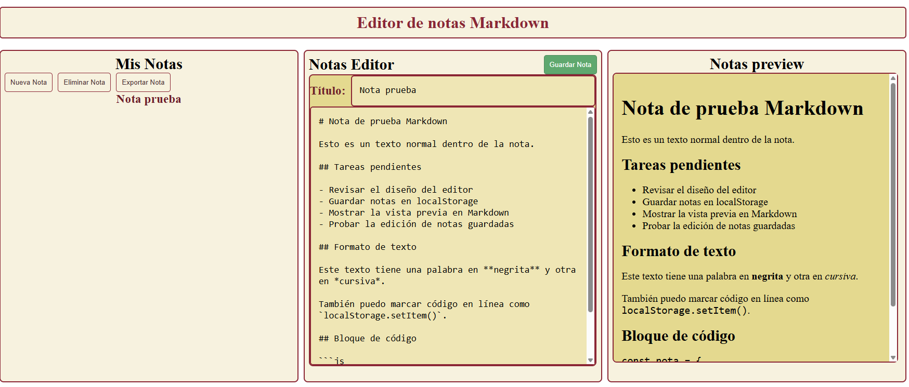

# Editor de Notas Markdown

Editor de notas Markdown desarrollado con HTML, CSS y JavaScript puro.  
El proyecto permite crear, guardar, editar, eliminar, previsualizar y exportar notas escritas en formato Markdown.



## Descripción

Este proyecto consiste en una aplicación web sencilla para gestionar notas en Markdown desde el navegador. El usuario puede escribir una nota con título y contenido, guardarla en el almacenamiento local del navegador y recuperarla posteriormente desde el listado de notas.

Además, el editor incluye una vista previa que transforma el contenido Markdown en HTML visual usando la librería Marked.js.

## Funcionalidades principales

- Crear notas con título y contenido.
- Guardar múltiples notas en `localStorage`.
- Mostrar las notas guardadas en un listado lateral.
- Seleccionar una nota guardada para cargarla de nuevo en el editor.
- Editar notas existentes.
- Eliminar la nota seleccionada.
- Previsualizar el contenido Markdown en tiempo real.
- Exportar una nota como archivo `.md`.
- Interfaz dividida en tres zonas: listado, editor y vista previa.

## Tecnologías utilizadas

- HTML5
- CSS3
- JavaScript
- LocalStorage
- Marked.js

## Estructura del proyecto

```txt
Editor_de_Notas_Markdown/
│
├── index.html
├── style.css
├── app.js
├── README.md
└── img/
        └── editorNotasMarkdown.png
